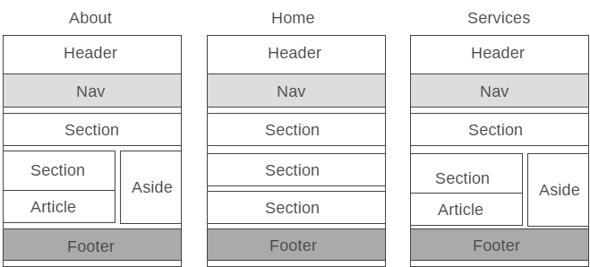

# Development Strategy

> `Acme-web-design`

It's a responsive HTML5 website that was build using branches on GitHub. On each branch you see a banch of code added, that works.  

## Wireframe

## 0. Set-Up

__A User can see my initial repository and live demo__

### Repo

- Generate from Template
- Write initial, basic README
- Turn on GitHub Pages

## 1. HTML header and footer

### Repo

We work on the branch `header-footer`.

### HTML

- We add the header with navigation bar on the HOME-page
- We add the footer of the HOME-page 

### CSS

- There are no CSS rules yet.

## 2. The main section of the HOME page

### Repo

We work on the branch `section-showcase`.

### HTML

- We add showcase section of the HOME-page with the background photo
- We add newsletter section

### CSS

- We add style rules for the body of the HOME-page
- We add style of the header&nav

## 3. The section with the pictures

### Repo

We work on the branch `section-boxes`.

### HTML

- We add the section with 3 photos and the description under each of them 

### CSS

- We add style rules for the main showcase section
- We add style of the newsletter section

## 4. ABOUT-page

### Repo

We work on the branch `about-page`.

### HTML

- We add about.html file

### CSS

- We add style rules for the section with the pictures
- We add style of the footer
- We add style for the ABOUT-page

## 5. SERVICES-page

### Repo

We work on the branch `services-page`.

### HTML

- We add services.html file

### CSS

- We add style of the services

## 6. Media queries

### Repo

We work on the branch `media-queries`.

### HTML

- There is no new HTML

### CSS

- We add media queries, this makes our website responsive (adjusting for the screen of the tablet or mobile device)

>## _Finishing Touches_
>Complete the development-strategy and check for possible mistakes.
